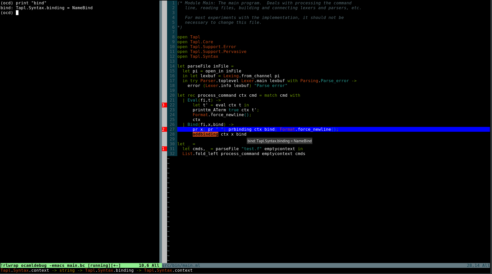

**Shameless debugger plugin using ocamldebug.**

**Author: Rehan Malak based on termdebug.vim from Bram Moolenaar**

**Copyright: Vim license applies, see ":help license"**

I shamelessly removed everything I don't like or don't understand in termdebug.vim and adapted the plugin for ocamldebug (instead of gdb)

It makes vim almost as cool as "Bordland Turbo C debugger". Look at this :

I don't care if Haskell is a cleaner language than OCaml... "Math is the only truly universal language." -- Jodie Foster

**USAGE** :

This works only on my laptop (a 10 years old Linux-based laptop). **Don't use it.**

``git clone inside ~/.vim/plugin/``

I always use dune buildsystem with a symlink main.bc -> _build/default/src/main.bc
so I can use this plugin with :

``gvim -c ':Ocamltermdebug' src/main.ml``
